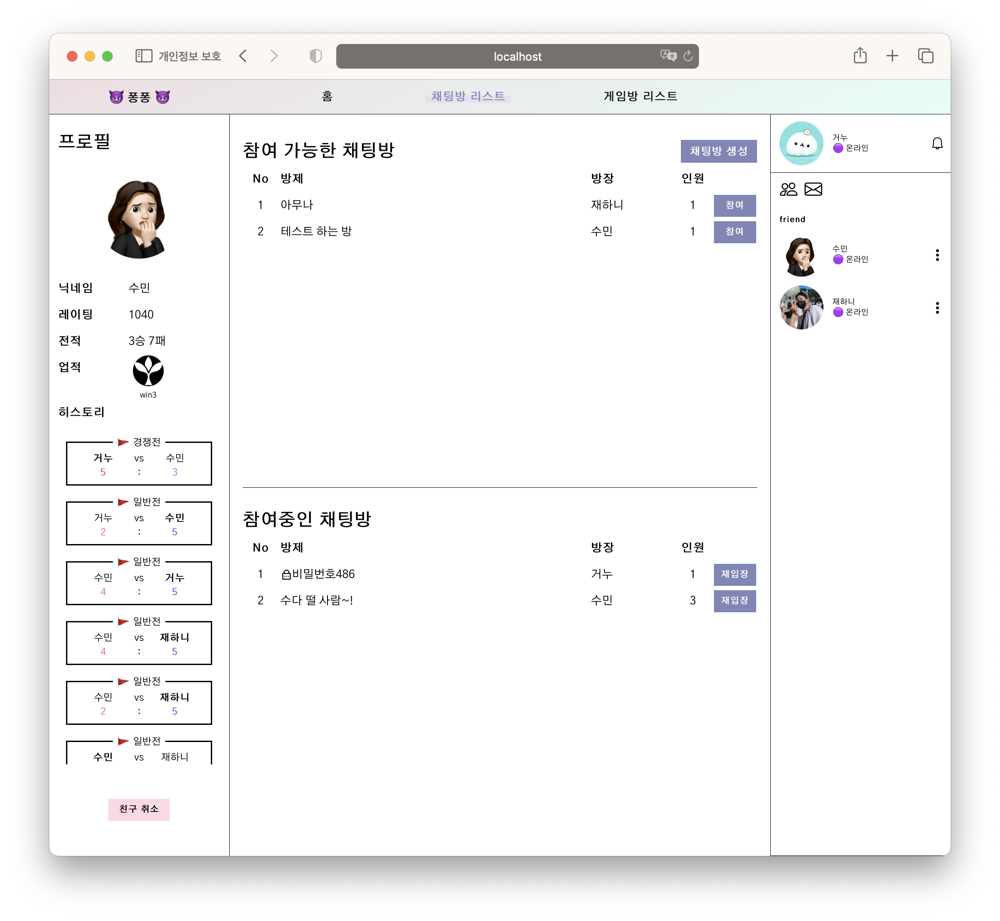
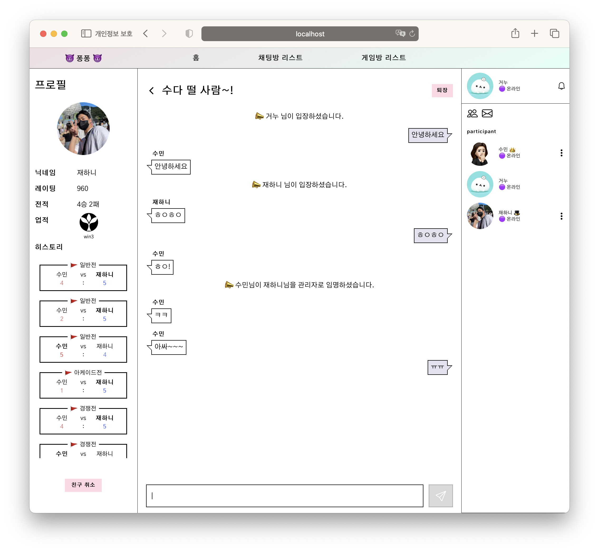
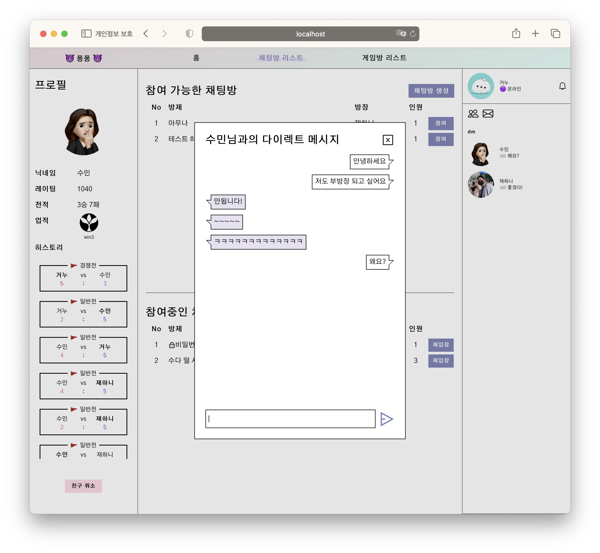
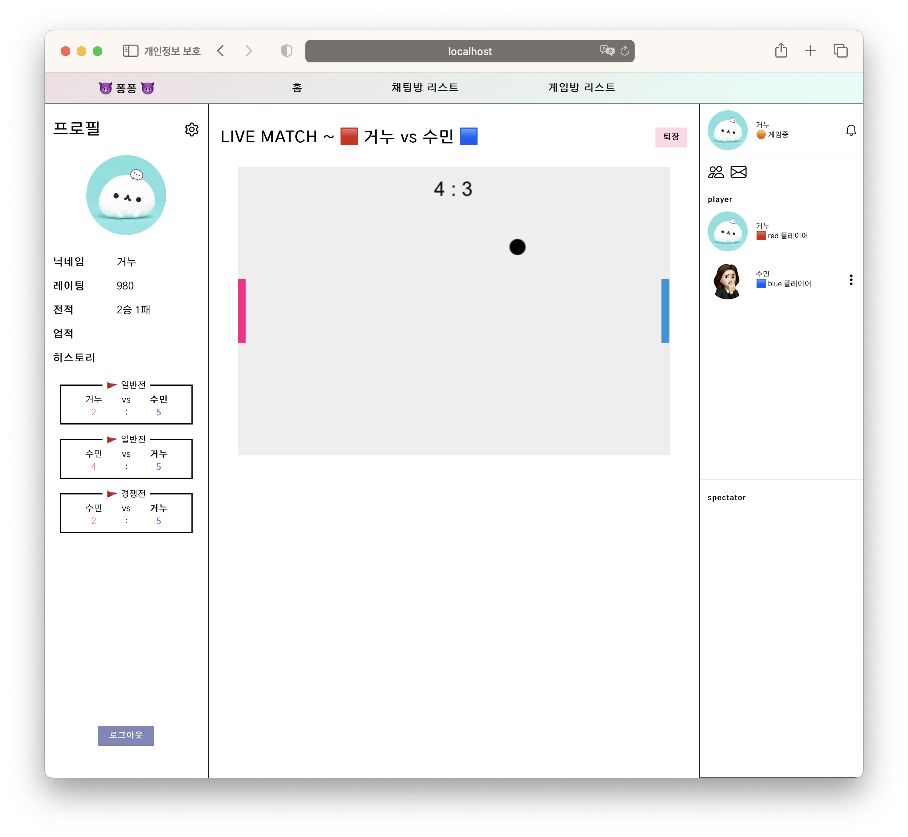

# pongpong

### 프로젝트 인원
* BE : seojin
* FE : hossong sumsong

### 프로젝트 기간: 2023. 03. 29 - 2023. 05. 29

### 기술 스택
- **공통**: Docker, Socket.io, Figma/Figjam
- **FE**: React, TypeScript, Vite, Npm, Axios, React-Query, Emotion/styled-components
- **BE**: Nest.js, TypeScript, Npm, PostgreSQL

### 기능 명세
* 유저
  * 42 Intra의 OAuth2.0을 이용한 유저 인증
  * 고유한 닉네임과 프로필 이미지 설정
  * 문자 메시지를 이용한 2차 인증 설정 가능
* 친구
  * 타 유저 친구 추가/삭제 가능
  * DM을 보내거나 게임 신청, 채팅방 초대 가능
* 프로필
  * 게임 전적 확인 가능
  * 획득한 업적 조회 가능
  * 매치 히스토리 확인 가능
* 채팅
  * 공개방 : 모든 유저 참여 가능
  * 비밀번호방 : 방장이 설정한 비밀번호로만 참여 가능
  * 비공개방 : 초대로만 참여 가능
  * DM : 유저와 1:1 다이렉트 메시지
  * 방장/부방장은 고유한 권한을 가짐
    * 방장은 부방장을 임명할 수 있음
    * 방장은 방의 설정(공개/비밀번호/비공개)을 변경하거나, 방의 비밀번호 변경 가능
    * 일반 참여자를 일정 시간동안 음소거 시킬 수 있음
    * 일반 참여자를 내보내거나, 입장 금지 할 수 있음
  * 모든 참여자는 다른 참여자를 차단할 수 있으며, 차단한 유저의 채팅은 보이지 않게 됨
  * 모든 참여자는 다른 참여자의 프로필 조회, DM 보내기, 게임 신청 가능
* 게임
  * 일반전 : 경쟁 점수에 영향을 주지 않는 게임 모드
  * 경쟁전 : 경쟁 점수에 영향을 주는 게임 모드
  * 아케이드 : 공 2개로 플레이하는 특별 모드
  * 매치메이킹 큐 등록 시스템을 통한 1:1 게임 매칭
  * 게임 타입에 따라 별도의 큐 등록
  * 게임중인 방은 게임리스트에서 제한 없이 실시간 관전 가능
  * 플레이중인 방에서는 플레이어와 관전자 리스트 조회 가능

 

## 채팅 리스트

## 실시간 채팅

## 1:1 DM

## 실시간 게임
